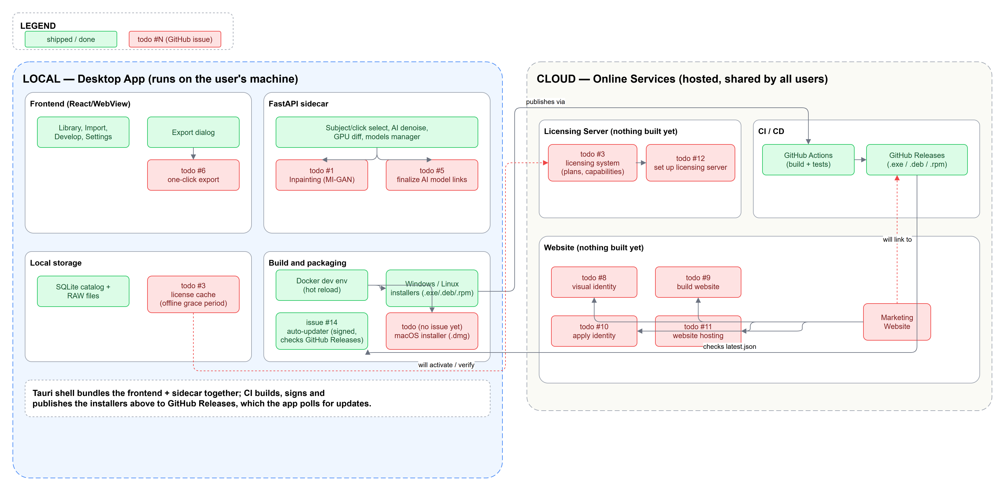

# RawStudio — Architecture Local vs Cloud (existant + roadmap)

Diagramme scindé en deux blocs séparés par une bordure en pointillés :
**Local** (app desktop, sur la machine de l'utilisateur) et **Cloud**
(services en ligne), reliés par seulement deux flux pour rester lisible
(install/update, activation licence). Chaque bloc est découpé en sous-blocs
(Frontend / FastAPI sidecar / Local storage / Build & packaging côté Local ;
CI-CD / Website / Licensing Server côté Cloud). Vert = fonctionnalité déjà
livrée ; rouge `todo #N` = tâche restante (numéro d'issue GitHub) — voir la
légende sur le schéma.

Généré avec [draw.io](https://www.drawio.com/) (rendu pro, arêtes
orthogonales propres). Source éditable :
[`infra-architecture.drawio`](infra-architecture.drawio) (ouvrable
directement dans l'app draw.io pour ajuster à la main), généré par
[`infra_diagram.py`](infra_diagram.py) — pour régénérer après une mise à jour
des issues :

```sh
python docs/infra_diagram.py
"C:\Program Files\draw.io\draw.io.exe" -x -f png -b 20 -s 2 -o docs/infra-architecture.png docs/infra-architecture.drawio
```



## Local — Desktop App

- Frontend (React/WebView) : Library, Import, Develop, Settings, Export ✅ ; export en un clic (#6) à faire.
- Sidecar FastAPI : sélection sujet/clic, débruitage IA, diff GPU, gestion des modèles ✅ ; inpainting MI-GAN (#1) et finalisation des liens de modèles (#5) restent à faire.
- Stockage local : catalogue SQLite + RAW ✅ ; cache de licence hors-ligne pas encore implémenté (fait partie de #3).
- Build & packaging : Docker dev env, installeurs Windows/Linux, auto-updater signé qui interroge GitHub Releases (#14) ✅ ; installeur macOS (.dmg) pas encore fait — pas d'issue GitHub dédiée pour l'instant.

## Cloud — Online Services

- CI/CD : build + GitHub Releases déjà en place (alimenté par le packaging local).
- Marketing Website : **rien n'est construit** — identité visuelle (#8) → site (#9) + application de l'identité (#10) → hébergement (#11).
- Licensing Server : **rien n'est construit** — `licensing.can()`, cache de licence, plans/capabilities (#3) et mise en place du serveur (#12) sont tous à faire ; #12 dépend de #3. Le paiement (Stripe ou autre) est explicitement hors scope de #3, pas représenté ici.

## Hors scope (pour l'instant)

- Détail du pricing/paiement (issue #3 l'exclut explicitement).
